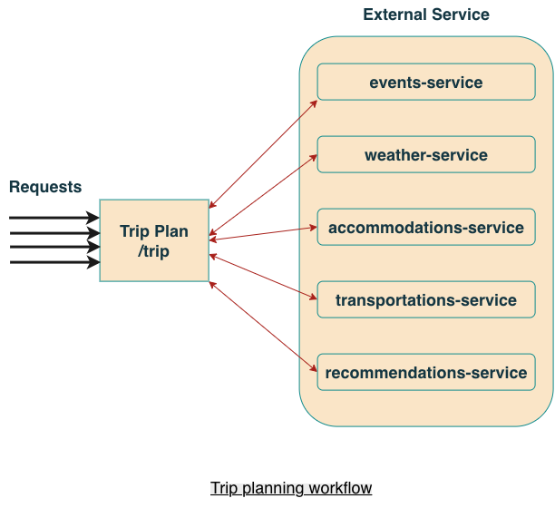
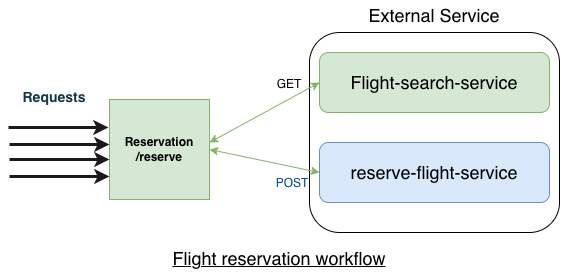
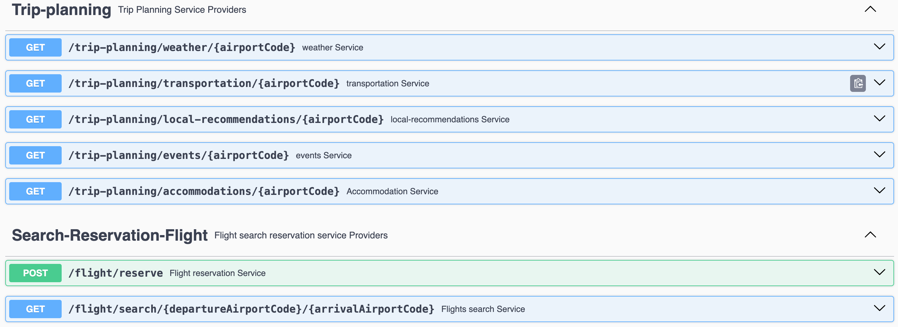
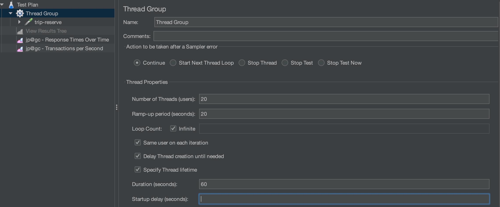
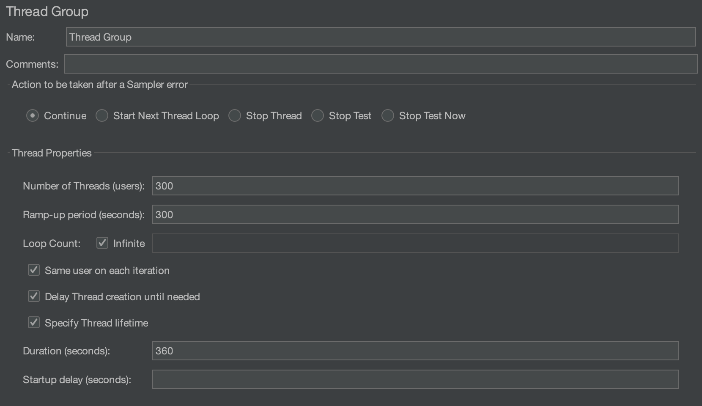
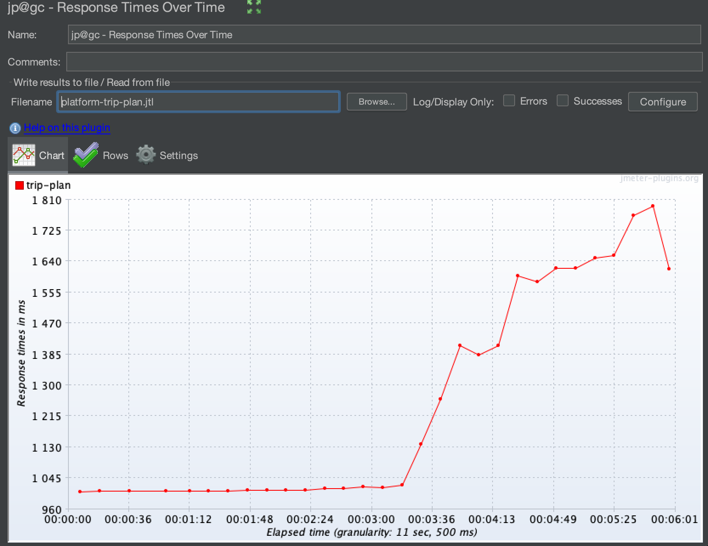
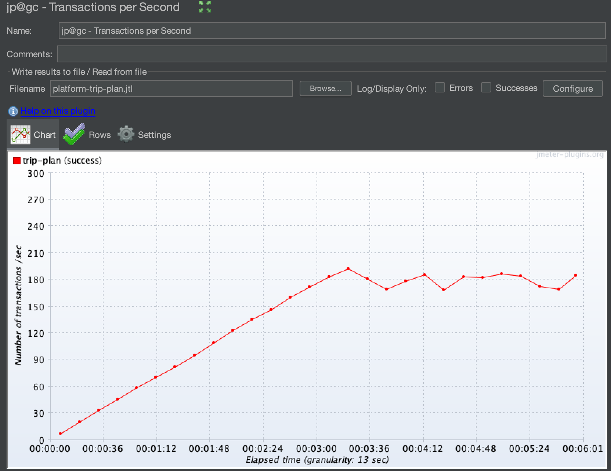
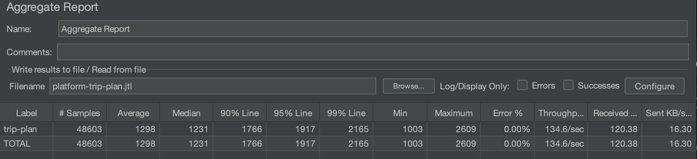
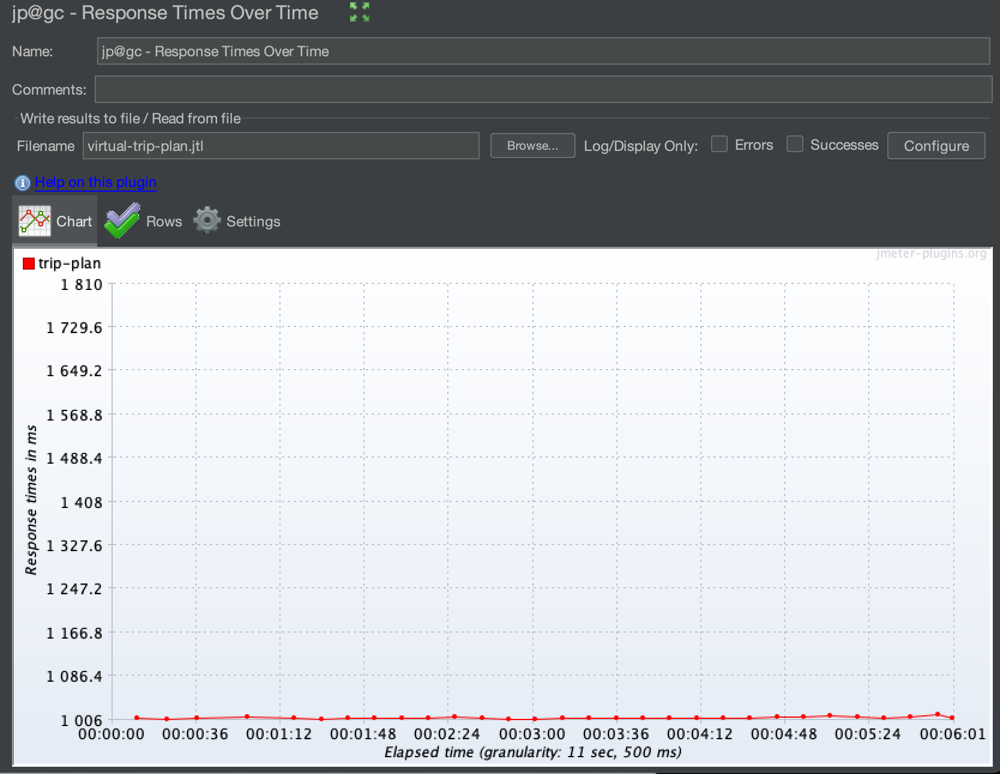
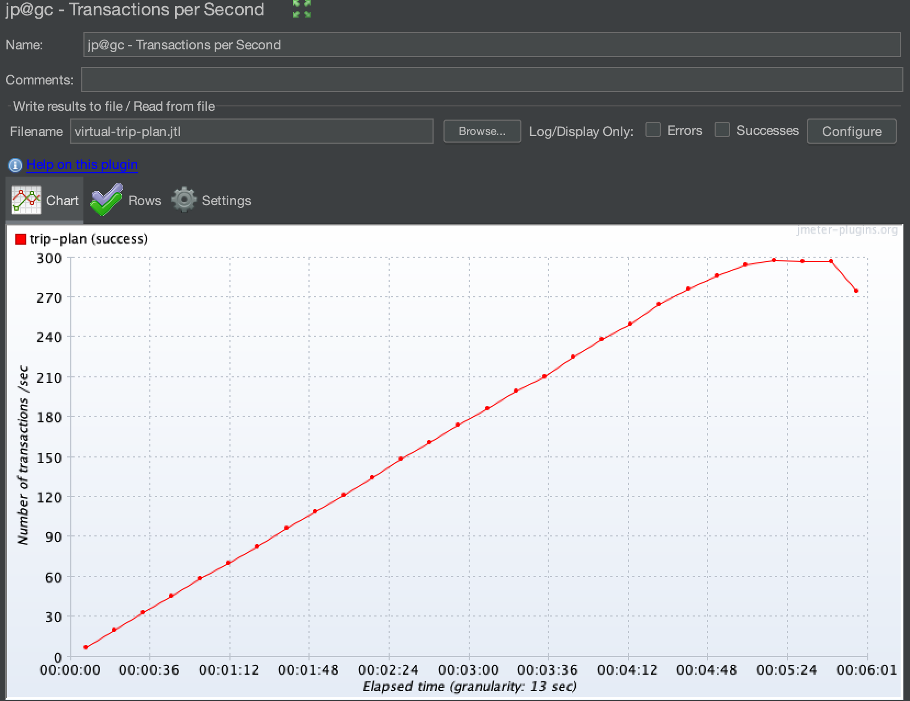

# Trip Advisor — Scalability Test with Java Virtual Threads

Applications can be affected by many factors when the number of concurrent users increases, including system architecture, database design, infrastructure, hosting, caching, code optimization, and load balancing.

This project demonstrates one specific scalability strategy: **Java platform threads vs. virtual threads**.

The goal is to compare how the application behaves under increasing concurrent load when using traditional platform threads versus Java virtual threads.

The project uses Spring Boot and `RestClient` to communicate with external services. The external services are heavily mocked and are intended for demonstration and experimentation rather than production use.

## 1. Project Overview

The `trip-advisor` application exposes two main entry points:

- `GET /trip/{airportCode}` — trip-planning retrieves trip information by aggregating information from several services.
- `POST /reserve` — reserves a flight.

The trip-planning endpoint aggregates information related to:

- Weather
- Events
- Accommodation
- Transportation
- Recommendations

Note: The scalability tests described in this README focus on the **trip-planning endpoint**.

### 1.1. Trip planning


The trip-planning endpoint aggregates information from multiple external services before returning the trip information.

The endpoint used by the JMeter test is:

```
GET http://localhost:8080/trip/LAS
```

The `LAS` airport code is used as the test input in the JMeter test plan.

### 1.2. Flight reservation



Note: this endpoint result is not include in this documentation on purpose.

### 1.3. External service

The application communicates with several external services.

For this demonstration, these services are heavily mocked so that the scalability experiment can focus primarily on the application and its thread model.

The external service JAR is located in the `external-service` directory.

### Running the external service locally

The service can be started directly with Java:

```
java -jar external-services.jar --server.port=7070
```

### Running the external service with Docker

A Docker image can be created using a Java 21+ runtime:

```
FROM bellsoft/liberica-openjdk-alpine:21
WORKDIR app
ADD https://github.com/Mick-J/trip-advisor/tree/main/external-serviceexternal-service.jar
CMD java -jar external-services.jar
```

Build the image:

```
docker build -t external-services .
```

Run the container:

```
docker run -p 7070:7070 external-services
```

The external service provides several endpoints that can be explored through Swagger:

```
http://localhost:7070/swagger-ui/
```

Here are available endpoints to tests for this demo:


## 2. Scalability setup

The scalability experiment compares two configurations of the Spring application:

| Configuration    | Spring value                           |
| ---------------- | -------------------------------------- |
| Platform threads | `spring.threads.virtual.enabled=false` |
| Virtual threads  | `spring.threads.virtual.enabled=true`  |

The same JMeter workload is executed against both configurations so that the thread model is the primary variable being compared.

### Metrics

The experiment focuses on the following metrics:

- `Response Times Over Time`
- `Transactions Per Second (TPS)`
- `Aggregate Report`

The JMeter test plan contains result collectors for these measurements. The listeners are disabled in the `.jmx` file so that the test can be executed in non-GUI mode without relying on the JMeter GUI during the load test.

## 2.1. JVM warm-up

Before measuring the application, the JVM should be warmed up to reduce the influence of JVM startup and JIT compilation on the measurements.
The warm-up configuration used for the experiment is:

```bash
Number of Theads: 20
Ramp-up period(seconds): 20
Loop count infinite
Duration(seconds): 60
```



## 2.2. Test trip endpoint

The main scalability test uses a JMeter **Thread Group** to simulate a gradually
increasing number of concurrent users accessing the trip-planning endpoint.

The complete Thread Group configuration is:

| Setting                            | Value       |
| ---------------------------------- | ----------- |
| Action after Sampler Error         | Continue    |
| Number of Threads (users)          | 300         |
| Ramp-up Period                     | 300 seconds |
| Loop Count                         | Infinite    |
| Same User on Each Iteration        | Enabled     |
| Delay Thread Creation Until Needed | Enabled     |
| Specify Thread Lifetime            | Enabled     |
| Duration                           | 360 seconds |
| Startup Delay                      | None        |



In other words:

- JMeter gradually increases the load from 0 to 300 threads over 5 minutes.
- The test continues for a total of 6 minutes.
- Each thread continuously executes the trip-planning request.
- The test continues even if an individual sample fails.

These settings are defined directly in `trip-plan.jmx`.

The JMeter sampler sends:

```
GET http://localhost:8080/trip/LAS
```

with HTTP keep-alive enabled and redirect following enabled.

### 2.2.1. Platform Threads results

For the platform-thread test, start the Spring Boot application with:

```
spring.threads.virtual.enabled=false
```

Then execute the JMeter test in non-GUI mode:

```
jmeter -n -t trip-plan.jmx -l platform-trip-plan.jtl
```

Where:

- `-n` runs JMeter in non-GUI mode.
- `-t trip-plan.jmx` specifies the JMeter test plan.
- `-l platform-trip-plan.jtl` stores the test results.

### Response Times Over Time



### Transactions per Second



### Aggregation report



### 2.2.2. Virtual Threads results

For the virtual-thread test, start the Spring Boot application with:

```
spring.threads.virtual.enabled=true
```

Execute the same JMeter test plan:

```
jmeter -n -t trip-plan.jmx -l virtual-trip-plan.jtl
```

The workload remains unchanged. This is important because it allows the two tests to be compared using the same JMeter configuration.

### Response Time Over Time



### Transactions per Second



### Aggregation report


### 2.2.3. Test results

The virtual-thread configuration processed more requests than the platform-thread configuration:

| Metric                                   | Platform Threads | Virtual Threads |
| ---------------------------------------- | ---------------- | --------------- |
| Test duration                            | 360 s            | 360 s           |
| Total requests                           | 48,603           | 62,445          |
| Additional requests with virtual threads | —                | 13,842          |
| Difference                               | —                | ~28.5%          |

The recorded request counts show:

```
Additional requests with virtual threads: 13,842
```

or approximately:

```
28.5% more requests
```

The experiment therefore provides a practical demonstration of how changing the Spring thread configuration can affect application behavior under concurrent load.

## References

- https://medium.com/@gauravrmsc/virtual-threads-under-the-hood-carriers-pinning-scaling-5638e6fbbd66
- https://vfunction.com/blog/application-scalability/
- https://www.udemy.com/course/java-virtual-thread/
- https://www.udemy.com/course/java-multithreading-concurrency-performance-optimization/
